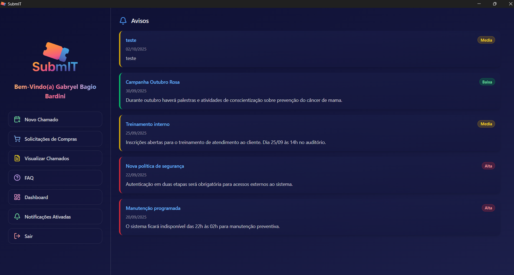
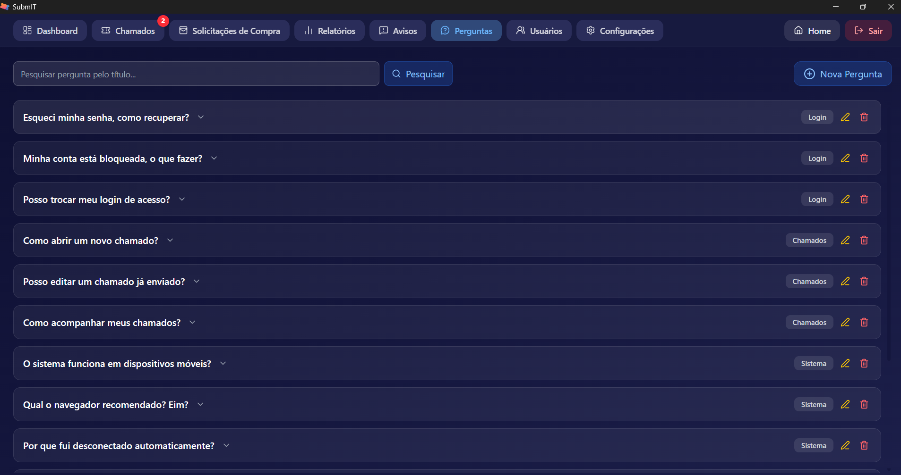

# Helpdesk System — Technical Support Platform

[](#)


Sistema interno de **suporte técnico e gerenciamento de chamados**, permitindo que funcionários abram solicitações, anexem arquivos, acompanhem o progresso e interajam com a equipe de suporte.  
Desenvolvido com **React + Vite + TailwindCSS** no front, **Node.js + Express + Sequelize + MySQL** no back e empacotamento via **Tauri 2** para desktop.

> **Monorepo** com dois projetos: `server/` onde está localizado o _backend_ e `client/` com o _frontend_ + configurações **Tauri**.

---

## Screenshots

### Login



### Chamados


## Solicitações de Compra


### Painel de Suporte


### Configurações




---

## Funcionalidades Principais

- **Autenticação JWT**: login seguro com tokens, transmitidos via header.
  > Não utiliza cookies, permitindo funcionamento dentro do app desktop (Tauri).
- **Abertura e Acompanhamento de Chamados**: criação de chamados com anexos, prioridade, descrição e status dinâmico.
- **Respostas e Histórico**: cada interação gera um registro, mantendo o histórico completo do atendimento.
- **Painel de Suporte**: visualização global dos chamados por status, empresa ou responsável.
- **Notificações em Tempo Real**: sistema com _Socket.IO_ que alerta suporte e usuários sobre novas mensagens ou atualizações.
- **Gestão de Usuários, Empresas e Setores**: controle de permissões e relacionamentos entre entidades.
- **Dashboard Dinâmico**: indicadores de chamados abertos, resolvidos e tempos médios de resposta.
- **Interface Moderna**: construída com TailwindCSS e Lucide React, com modo escuro nativo e animações leves.
- **Empacotamento Desktop**: app Tauri 2 com integração direta ao backend interno.

---

## Stack

### Frontend

- React 19 + Vite 7
- TailwindCSS v4
- React Router
- Lucide React
- Axios
- Framer Motion
- Socket.IO Client
- Tauri 2 (Desktop)

### Backend

- Node.js 18+
- Express 5
- Sequelize + mysql2
- Multer (upload de anexos)
- JWT + Bcrypt
- Dotenv
- Cors
- Socket.IO (Realtime)

---

## Estrutura do Projeto

```
├── client/ # Frontend (React + Tailwind + Vite + Tauri)
│ ├── public/ # Imagens, ícones e manifestos
│ ├── src/
│ │ ├── components/ # Componentes reutilizáveis
│ │ ├── pages/ # Páginas principais (Login, Chamados, Usuários, etc.)
│ │ ├── services/ # API e integrações com backend
│ │ ├── assets/ # Logos, ícones e imagens
│ │ └── main.jsx # Entrada principal do React
│ └── tauri.conf.json # Configurações de build desktop
│
├── server/ # Backend (Node.js + Express + Sequelize)
│ ├── src/
│ │ ├── config/ # Configurações de banco, auth e variáveis
│ │ ├── controllers/ # Lógica de controle das rotas
│ │ ├── models/ # Modelos Sequelize
│ │ ├── routes/ # Rotas Express
│ │ └── utils/ # Funções auxiliares e middlewares
│ └── server.js # Ponto de entrada do backend
│
└── docker-compose.yml # Configuração para containers frontend + backend + banco
```

---

## Pré-requisitos

- Node.js 18+ e npm
- MySQL 8+
- Rust toolchain (Para build desktop com Tauri)

---

## Scripts Principais

### Backend

```
bash
cd server
npm install
npm run dev
```

### Frontend

```
cd client
npm install
npm run dev
```

### Build Desktop (Tauri)

```
cd client
npm run tauri build
```

### Execução com Docker

```
docker-compose up --build
```

## Autenticação e Segurança

- Login gera **JWT** com expiração de 8h (`Authorization: Bearer <token>`)
- Rotas protegidas exigem autenticação
- Uploads validados por tipo de arquivo e tamanho
- Logs automáticos de ação por usuário

---

## TODO

- [ ] Suavização nas animações entre telas
- [ ] Permitir avisos em formato Markdown para melhor exibição
- [ ] Personalização de perfil por usuário
- [ ] Exportação de logs
- [ ] Melhorar UX das notificações em tempo real

---

## Autor

**Gabryel Bagio Bardini**  
Full-Stack Developer • Infinity Sistemas  
📧 [gabryel.bgorleans@gmail.com](mailto:gabryel.bgorleans@gmail.com)
